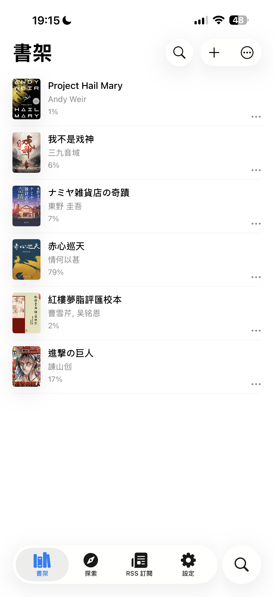
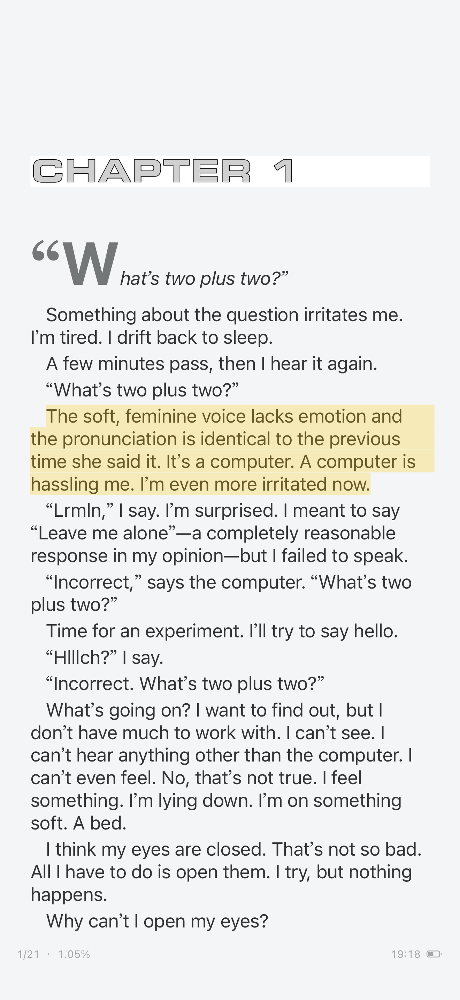
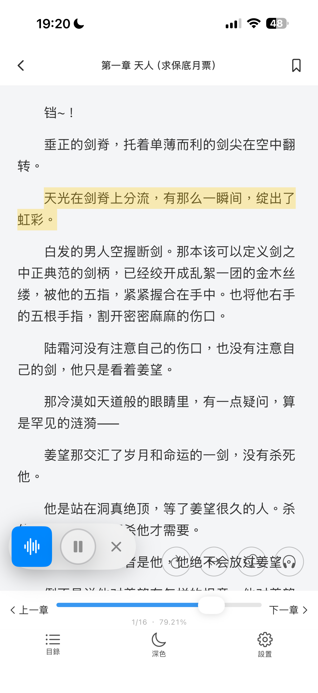
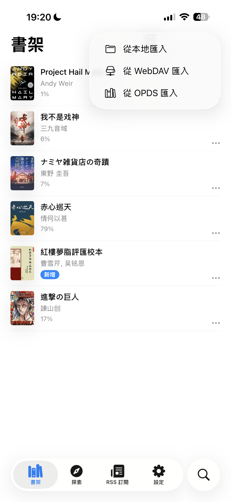

# Yuedu Reader

<p align="center">
  
</p>

<p align="center">
  <strong>A native iOS reader powered by CoreText.</strong><br>
  EPUB / TXT / Markdown / RSS / Manga / OPDS / WebDAV / TTS / CJK vertical writing.
</p>

<p align="center">
  <a href="README.zh-Hans.md">简体中文</a> ·
  <a href="README.md">English</a>
</p>

<p align="center">
  <a href="https://apps.apple.com/app/id6772972358">
    
  </a>
  <a href="https://testflight.apple.com/join/7hvbzYC1">
    
  </a>
  <a href="https://t.me/+ZWmmgMwwJ3JiN2Rl">
    
  </a>
  <a href="https://iosdevweekly.com/issues/751">
    
  </a>
</p>

<p align="center">
  <a href="#features">Features</a> ·
  <a href="#screenshots">Screenshots</a> ·
  <a href="#downloads">Downloads</a> ·
  <a href="#getting-started">Getting Started</a> ·
  <a href="#troubleshooting">Troubleshooting</a> ·
  <a href="#contributing">Contributing</a> ·
  <a href="#license">License</a>
</p>

<p align="center">
  
</p>

Yuedu Reader is an iOS-first reading app for serious long-form reading. It focuses on native typography, CJK vertical writing, local libraries, manga, RSS, web article normalization, TTS, OPDS and WebDAV import/sync, and user-provided book-source workflows.

> Featured in [iOS Dev Weekly #751](https://iosdevweekly.com/issues/751) — [*From WebView to CoreText: Building a Native EPUB Reader for iOS*](https://chang-jui-lin.github.io/Yuedu-reader/2026/05/20/from-webview-to-coretext/).

## Why Yuedu

- Native iOS reader UI built with SwiftUI and CoreText, not a WebView-first reading surface.
- CoreText pagination for stable reading positions, highlights, and TTS progress.
- CJK vertical writing with right-to-left reading flow and vertical table of contents.
- Local-first library for EPUB, TXT, Markdown, and local manga archives.
- Online reading workflows through user-provided RSS, OPDS, WebDAV, web pages, and compatible source rules.
- Clear project boundary: Yuedu does not bundle, recommend, or distribute copyrighted content sources.

## Features

| Area | Capability | Status |
| --- | --- | --- |
| Local books | EPUB reflowable reading with chapter navigation, images, links, bookmarks, highlights, annotations, and TTS | Available |
| Local books | TXT and Markdown reading | Available |
| Manga | Local `.cbz` / `.zip` manga archives and compatible source-based manga reading | Available |
| Reader modes | Paged and scroll reading modes | Available |
| CJK typography | Vertical writing, right-to-left flow, CJK punctuation handling, and vertical table of contents | Available |
| Library import | OPDS catalog import | Available |
| Sync/import | WebDAV import and sync | Available |
| Online reading | RSS / Atom feeds and native article reading | Beta |
| Online reading | Web article normalization into clean long-form reading content | Beta |
| Book sources | Legado-compatible source rules for user-provided online reading workflows | Beta |
| Rendering quality | EPUB regression samples and compatibility checklist | Available |
| EPUB layout | Fixed-layout EPUB prototype | Experimental |
| Accessibility | Broader VoiceOver, Dynamic Type, and touch target work | Planned |

## Supported Formats

| Category | Supported | Notes |
| --- | --- | --- |
| Local books | EPUB, TXT, Markdown | EPUB support focuses on reflowable books and native CoreText rendering. |
| Manga archives | CBZ, ZIP | Opened in a dedicated image reader. |
| Online feeds | RSS, Atom | Articles are extracted and read inside the native reader. |
| Catalogs and sync | OPDS, WebDAV | Import books from catalogs and WebDAV servers; sync through WebDAV. |
| Source rules | Legado-compatible rules | Format compatibility only; no third-party source rules are bundled. |
| Not the current focus | PDF, MOBI, AZW3, FB2, DOCX | Yuedu is intentionally iOS-native and CoreText-focused rather than a broad cross-platform format suite. |

## Screenshots

### Library and Reader

Yuedu presents a local-first bookshelf, native reader controls, CJK vertical reading, annotations, TTS, manga, RSS, and import workflows.

<p align="center">
  
  
  
</p>

### Reading Experience

CJK vertical writing, highlights, annotations, and TTS are part of the native reading surface.

<p align="center">
  
  
  
</p>

### Workflows

Yuedu also covers manga reading, RSS reading, OPDS/WebDAV import, and compatible user-provided book-source workflows.

<p align="center">
  
  
  
</p>

<p align="center">
  
</p>

## Downloads

- [Download from the App Store](https://apps.apple.com/app/id6772972358)
- [Join the latest TestFlight beta](https://testflight.apple.com/join/7hvbzYC1)
- [Support](https://chang-jui-lin.github.io/Yuedu-reader/support.html)
- [Privacy Policy](https://chang-jui-lin.github.io/Yuedu-reader/privacy.html)
- [Telegram group](https://t.me/+ZWmmgMwwJ3JiN2Rl)

Yuedu Reader currently targets iOS 18.0+.

## Roadmap

### Now

- Improve EPUB rendering compatibility.
- Polish CJK vertical reading and TOC behavior.
- Add EPUB rendering bug templates and regression samples.
- Improve RSS loading error handling.

### Next

- Better web article normalization.
- Richer manga sources and reader gestures.
- Fixed-layout EPUB prototype.

### Later

- TestFlight feedback loop.
- More accessibility work.
- More automated rendering regression tests.

See open issues labeled `help wanted` or `good first issue` if you want to contribute.

## Getting Started

Requirements for development:

- iOS 18.0+
- Xcode 16+
- Swift 5 language mode in the Xcode project

```bash
git clone https://github.com/CHANG-JUI-LIN/Yuedu-reader.git
cd Yuedu-reader
open Yuedu-Reader.xcodeproj
```

Select the `Yuedu-Reader` scheme and build for a simulator or device. Or run:

```bash
./scripts/build.sh
```

## Troubleshooting

- **App Store vs TestFlight**: App Store is the stable release. TestFlight receives newer builds first and may include unfinished behavior.
- **EPUB rendering bugs**: Please use the [EPUB rendering bug template](.github/ISSUE_TEMPLATE/epub_rendering_bug.yml). Include screenshots from Yuedu, screenshots from Apple Books if possible, EPUB type/version, chapter/page location, expected behavior, and actual behavior.
- **WebDAV, OPDS, RSS, or source-rule issues**: Include the URL or server type, the visible error message, the action that failed, and confirmation that the content source is legal and user-provided.
- **Copyrighted content**: Do not upload copyrighted books publicly. A minimal synthetic EPUB or redacted sample is preferred.

## Project Boundary

Yuedu Reader is a reader engine and app shell. It does not include, host, recommend, or distribute copyrighted content sources.

Users are responsible for making sure imported files, RSS feeds, websites, custom rules, cookies, accounts, and generated content comply with applicable laws, copyright requirements, and website terms.

The project will not accept contributions for built-in piracy sources, DRM circumvention, paywall bypassing, private-token sharing, cookie harvesting, or anti-bot bypass logic.

Legado compatibility is a source-rule format compatibility target only. Yuedu Reader does not bundle third-party source rules and is not affiliated with the [Legado](https://github.com/gedoor/legado) project.

## Architecture Notes

Most EPUB readers use WebView. Yuedu uses CoreText for the main reader so it can control pagination, text ranges, highlights, TTS synchronization, and CJK vertical rendering more precisely.

Yuedu currently has two EPUB rendering paths that share the same CSS resolution and CoreText drawing layer:

- Legacy HTML attributed-string builder
- RenderableNode IR pipeline

Most contributors do not need to understand the full engine before working on UI, docs, localization, EPUB testing, WebDAV, RSS, or source-rule features.

For details, see:

- [CoreText contributor notes](docs/coretext/README.md)
- [Architecture notes](Technotes/Architecture.md)
- [EPUB compatibility checklist](docs/epub-compatibility-checklist.md)
- [EPUB regression samples](docs/epub-regression/README.md)

## Contributing

Yuedu welcomes focused contributions in documentation, screenshots, EPUB testing, localization, accessibility, WebDAV/OPDS testing, reader UI polish, and rendering compatibility.

Start here:

- [Contributing guide](CONTRIBUTING.md)
- [EPUB rendering bug template](.github/ISSUE_TEMPLATE/epub_rendering_bug.yml)
- [CoreText contributor notes](docs/coretext/README.md)
- [EPUB regression samples](docs/epub-regression/README.md)
- [Demo media workflow](docs/demo/README.md)

## Repository Layout

```text
iOS/
├── Models/
│   ├── App/              # Global settings, DesignTokens, AppDependencies
│   ├── Book/             # ReadingBook, Bookmark, BookStore
│   ├── BookSource/       # Book source definitions and fetch pipeline
│   ├── LocalBook/        # EPUB/TXT/Markdown parsers
│   ├── Online/           # Online reading and web normalization
│   ├── RSS/              # RSS models, feed parser
│   ├── Reader/CoreText/  # CoreText page engine, scroll engine, CSS parser, rendering
│   ├── RuleEngine/       # CSS/XPath/Regex/JSON extraction rules
│   ├── Sync/             # WebDAV sync manager
│   └── TTS/              # Text-to-speech coordination
├── Views/                # SwiftUI screens
├── ViewModels/           # ObservableObject view models
├── Assets/               # Asset catalogs and rule engine resources
└── *.lproj/              # Localization: zh-Hans, en
```

## Development Notes

- Use `localized()` for user-facing strings; update all three `.lproj` files.
- Keep reading position based on content coordinates, not page indexes.
- Style UI with design-token APIs: `DSColor`, `DSFont`, `DSSpacing`.
- Add a compiling SwiftUI preview (`#Preview` or `PreviewProvider`) when creating or changing view code wherever practical.
- CSS properties added to `ResolvedStyle` must mirror in `RenderStyle`, update `RenderStyle.from`, and handle both rendering paths.
- Nested block CSS margins accumulate through `inheritedBlockMarginLeft`.
- Keep source/rule-engine work limited to legal, user-provided content workflows.

## AI-Assisted Development

This repository is developed with heavy AI-assisted collaboration, including code generation, refactoring, documentation, and review support. Human review and project ownership remain part of the workflow.

If you strongly prefer strictly human-authored code or are uncomfortable with AI-assisted development, please review the project with that expectation in mind.

## License

[MIT](https://opensource.org/license/mit). See [LICENSE](LICENSE). This project links against [Readium](https://github.com/readium) components, which are BSD-licensed.
