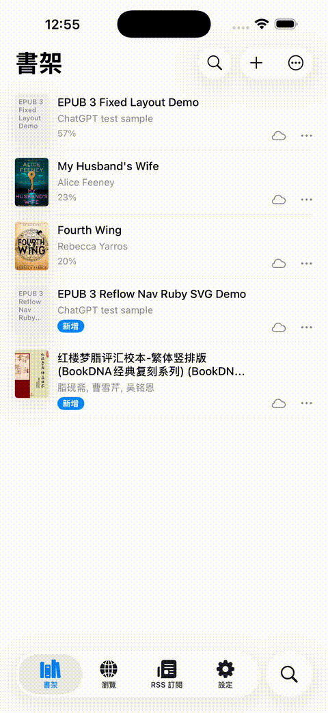

# 阅读

<p align="center">
  
</p>

<p align="center">
  <strong>一个由 CoreText 驱动的 iOS 原生阅读器。</strong><br>
  EPUB / TXT / RSS / 漫画 / WebDAV / TTS / CJK 竖排阅读。
</p>

<p align="center">
  <a href="README.zh-Hans.md">简体中文</a> ·
  <a href="README.zh-Hant.md">繁體中文</a> ·
  <a href="README.md">English</a>
</p>

<p align="center">
  <a href="https://apps.apple.com/app/id6772972358">
    
  </a>
  <a href="https://testflight.apple.com/join/7hvbzYC1">
    
  </a>
  <a href="https://t.me/+ZWmmgMwwJ3JiN2Rl">
    
  </a>
  <a href="https://iosdevweekly.com/issues/751">
    
  </a>
</p>

<p align="center">
  <a href="https://chang-jui-lin.github.io/Yuedu-reader/support.html">支持</a> ·
  <a href="https://chang-jui-lin.github.io/Yuedu-reader/privacy.html">隐私政策</a>
</p>

<p align="center">
  
</p>

阅读是一个使用 SwiftUI 和 CoreText 构建的 iOS 原生阅读器，专注于长文本阅读、CJK 排版、本地 EPUB/TXT 书库、漫画、网页内容转码、RSS、TTS、OPDS 与 WebDAV 导入／同步，以及不依赖 WebView 的原生阅读界面。

> 📝 获 [iOS Dev Weekly #751](https://iosdevweekly.com/issues/751) 收录 —— [*From WebView to CoreText: Building a Native EPUB Reader for iOS*](https://chang-jui-lin.github.io/Yuedu-reader/2026/05/20/from-webview-to-coretext/)。

## CJK 竖排阅读

阅读不是只做基本 EPUB 显示，而是针对严肃 CJK 阅读场景设计。

它支持竖排、由右至左阅读流、CJK 标点、行内批注、竖排目录，以及 CoreText 分页。

<p align="center">
  
</p>

亮点：

- CJK 竖排文字渲染
- 竖排书籍的右至左目录
- CJK 标点处理
- 行内批注与高密度注释 EPUB 测试
- 基于 CoreText 分页，不以 WebView 作为主要阅读界面

## 英文 EPUB 也正常

阅读不只支持中文书。标准英文 EPUB 也可以渲染，包括出版商 CSS、章节导航、图片、链接和分页。

<p align="center">
  
  
</p>

支持的 EPUB 能力包括：

- Reflowable EPUB
- 出版商 CSS cascade
- Drop caps 和段落样式
- 图片与 SVG rasterization
- `toc.ncx` 和 `nav.xhtml` 导航
- 高亮、书签和 TTS

## 阅读工作流

阅读不只是本地 EPUB 阅读器，也包含 RSS 阅读和网页文章转码，支持在线阅读工作流。

- **RSS 阅读器**：RSS / Atom feed、文章提取，并在原生阅读器内阅读。
- **网页文章转码**：将网页转成干净的长文本阅读内容。
- **书源阅读**：兼容 Legado 书源的在线网文阅读——搜索、浏览目录，并在原生 CoreText 阅读器内阅读。
- **漫画阅读**：通过兼容书源阅读漫画，或导入本地漫画（`.cbz` / `.zip`），以专属图片阅读器浏览。
- **书库导入**：在书架的添加书籍菜单中，直接从 OPDS 目录与 WebDAV 服务器添加书籍。

<p align="center">
  
</p>

## 功能

- SwiftUI + CoreText 原生 iOS 阅读器
- EPUB / TXT / Markdown 本地阅读
- CJK 竖排与右至左阅读 UI
- 分页与滚动阅读模式
- 高亮、书签、标注
- TTS 与自动阅读
- 漫画阅读，专属图片阅读器（书源 + 本地 `.cbz` / `.zip` 导入）
- OPDS 目录导入
- WebDAV 导入与同步
- RSS / 网页文章阅读
- Legado 兼容书源规则
- EPUB regression samples 用于渲染兼容性检查

## 为什么使用 CoreText？

多数 EPUB 阅读器使用 WebView。阅读使用 CoreText 作为主要阅读渲染层，所以可以更精确控制分页、文字范围、高亮、TTS 同步和 CJK 竖排。

这让以下能力变得可控：

- 基于 `(spineIndex, charOffset)` 的稳定阅读位置
- 精确页面渲染
- 原生文字选择与高亮
- TTS 进度同步
- 自定义 CJK 竖排布局行为

## 渲染管线

阅读有两条 EPUB 渲染路径，它们共用同一套 CSS resolution 和 CoreText 绘制层：

- Legacy HTML attributed-string builder
- RenderableNode IR pipeline

多数贡献者在处理 UI、文档、本地化、EPUB 测试、WebDAV 或书源规则功能前，不需要先理解完整引擎。

详细内容见：

- [CoreText contributor notes](docs/coretext/README.md)
- [Architecture notes](Technotes/Architecture.md)

## EPUB 兼容性

阅读包含小型 EPUB regression corpus 和兼容性 checklist，用来测试渲染行为。

- [EPUB compatibility checklist](docs/epub-compatibility-checklist.md)
- [EPUB regression samples](docs/epub-regression/README.md)

## 环境要求

- iOS 18.0+
- Xcode 16+
- Xcode 项目目前使用 Swift 5 language mode

## 快速开始

```bash
git clone https://github.com/CHANG-JUI-LIN/Yuedu-reader.git
cd Yuedu-reader
open Yuedu-Reader.xcodeproj
```

选择 `Yuedu-Reader` scheme，构建至模拟器或实机。或直接运行：

```bash
./scripts/build.sh
```

## 项目边界

阅读是阅读器引擎和应用外壳，不内置、不托管、不推荐、也不分发任何受版权保护的内容来源。

用户需要自行确保导入文件、RSS feed、网站、自定义规则、cookie、账号和生成内容符合当地法律、版权要求和网站服务条款。

本项目不接受内置盗版源、DRM 绕过、付费墙绕过、私有 token 分享、cookie 提取或反爬绕过逻辑等贡献。

Legado 兼容性只代表书源规则格式兼容；阅读不内置第三方书源规则，也不是 [Legado](https://github.com/gedoor/legado) 项目的官方关联产品。

## AI 协同开发声明

本仓库重度使用 AI 协同开发，包括代码生成、重构、文档撰写和审查辅助。项目仍会保留人工审阅与维护责任。

如果你偏好完全由人手撰写的代码，或对 AI 辅助开发有疑虑或排斥，请在使用或贡献前自行评估，并请见谅。

## 目录结构

```text
iOS/
├── Models/
│   ├── App/              # 全局设置、DesignTokens、AppDependencies
│   ├── Book/             # ReadingBook、Bookmark、BookStore
│   ├── BookSource/       # 书源定义与获取管线
│   ├── LocalBook/        # EPUB/TXT/Markdown 解析器
│   ├── Online/           # 在线阅读与网页正规化
│   ├── RSS/              # RSS 模型、订阅解析
│   ├── Reader/CoreText/  # CoreText 翻页引擎、滚动引擎、CSS 解析、渲染
│   ├── RuleEngine/       # CSS/XPath/Regex/JSON 规则提取
│   ├── Sync/             # WebDAV 同步管理
│   └── TTS/              # 语音播放协调
├── Views/                # SwiftUI 界面
├── ViewModels/           # ObservableObject ViewModel
├── Assets/               # 资产目录与规则引擎资源
└── *.lproj/              # 本地化：zh-Hant、zh-Hans、en
```

## 开发

- 用户字符串使用 `localized()`，更新三个 `.lproj` 文件。
- 阅读位置以内容坐标为准，不用页码。
- UI 样式使用设计 token API：`DSColor`、`DSFont`、`DSSpacing`。
- 新增或修改 View 时，尽量加入可编译的 `#Preview` 或 `PreviewProvider`。
- 新增 CSS 属性至 `ResolvedStyle` 时，同步 `RenderStyle` 字段、更新 `RenderStyle.from`，并处理两条渲染路径。
- 嵌套区块 CSS 边距通过 `inheritedBlockMarginLeft` 累加。
- 书源和规则引擎相关工作必须限定在合法、用户自行提供内容的流程。

请见 [CONTRIBUTING.md](CONTRIBUTING.md)。演示素材流程见 [docs/demo/README.md](docs/demo/README.md)。

## 交流群

欢迎加入交流群，反馈问题、获取测试版与书源资讯：

- Telegram：<https://t.me/+ZWmmgMwwJ3JiN2Rl>
- QQ 群「阅读测试群」：群号 **1107613783** · [点击加入群聊](https://qun.qq.com/universal-share/share?ac=1&authKey=mNrlfOidh408YjJvObbFYjZOx1tV8n0yfS69xbwAS3xpBkaHEo1kP5O1ztPDmtjg&busi_data=eyJncm91cENvZGUiOiIxMTA3NjEzNzgzIiwidG9rZW4iOiJvYmtOSG1FdmErRGIzT05JOG94TEQ1cTdYZS9LbnFvdHNjZTlsQjNucjJNQ0pjT3BqeTRBOHM3L3N5TlUyejNkIiwidWluIjoiMjA4MTg1ODQzMCJ9&data=OvRT_XrwFaKXJRHD2QBjh3KYkAkZrb3WeB4ai3uHUnHMUpakpn54ykC1B7qplCLZ4ZCq3mUBoCabT_xlbXR6sA&svctype=4&tempid=h5_group_info)

<p align="center">
  
</p>

## 许可证

[MIT](https://opensource.org/license/mit)。详见 [LICENSE](LICENSE)。本项目链接 [Readium](https://github.com/readium) 组件，Readium 使用 BSD 许可证。
